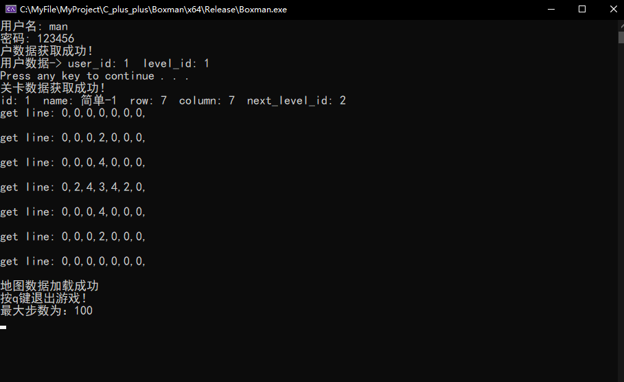
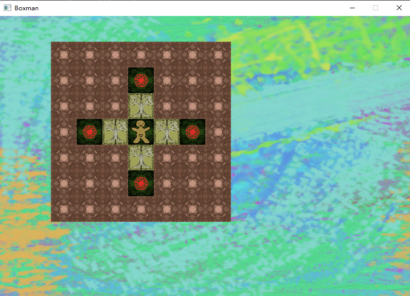
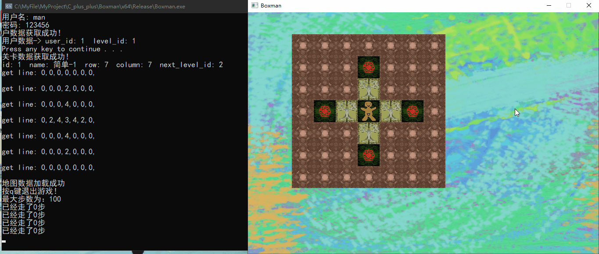

# Boxman v1.00

利用C++实现一个简单的推箱子游戏。

用户登录

- 用户名man
- 密码123456

玩法设计

- WASD进行移动
- 有步数限制，显示当前步数
- 箱子推到目标地后不动

# 文件简介

h/ccp 文件

- DataBase：连接MySQL接口，读取、保存用户和地图信息
- Boxman：实现推箱子的源代码

sql 文件

- Boxman：实现数据库创建的代码

png 文件

- 自己设计的图像素材，可以自行替换。

# 实现工具

- EasyX：一个针对 Visual C++ 的绘图库
- MySQL 8.0.27
- VS2019

# 游玩演示

1. 登录，获取用户数据和地图数据

2. 此时弹出游戏窗口

3.方块说明

- 主人公

- 地板

- 看起来不像箱子的箱子

- 箱子的目标地点

- 墙壁

4. 游玩演示

# v2.00可能的计划

- GUI完善，将命令行输入输出的内容结合到与游戏的GUI上面，然后关闭命令行窗口的显示
- 软件架构重构：由于数据库的连接是直接在客户端上进行，有必要在客户端与数据端划分出一个服务器端，避免连接数据库密码泄露和非法数据传送到数据库。
  - 客户端：发送用户名和密码到服务器端验证，负责主要的游戏实现并发送数据给服务器端。
  - 服务器端：利用数据库查询验证用户名和密码，检验客户端数据的合法性和安全性，将数据录入数据库。
  - 数据库：数据的存储。
- 。。。。
